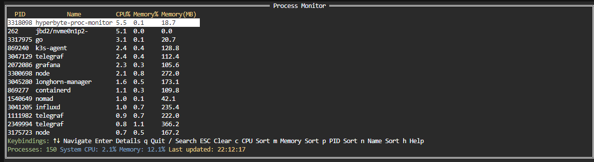
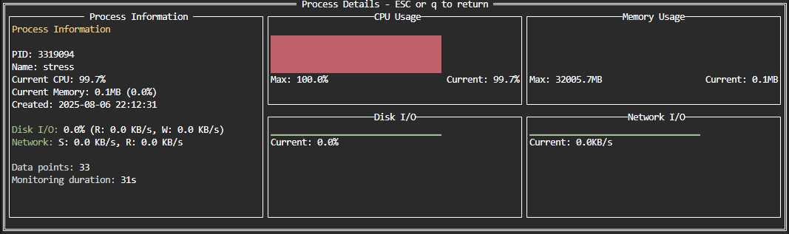

# Hyperbyte Pulse

A powerful terminal-based process monitor built in Go, featuring real-time process monitoring with ASCII graphs and an intuitive interface.





## Features

### Main View (Process List)
- **Live Process Monitoring**: Real-time display of all running processes
- **Sortable Columns**: Sort by PID, Name, CPU usage, or Memory usage
- **Search Functionality**: Filter processes by name or PID
- **Color-coded Usage**: Visual indicators for resource consumption
  - 🟢 Green: Normal usage (< 25%)
  - 🟡 Yellow: Medium usage (25-50%)
  - 🟠 Orange: High usage (50-80%)
  - 🔴 Red: Critical usage (> 80%)
- **Auto-refresh**: Updates every second automatically

### Detail View (Process Graphs)
- **Real-time ASCII Graphs**: Visual representation of process metrics
  - CPU usage percentage over time
  - Memory usage in MB over time (scaled to machine's total memory)
  - Disk I/O activity as percentage of system I/O - sparkline format
  - Network I/O activity (sent/received KB/s) - sparkline format
- **Process Information Panel**: Detailed info including current I/O rates
- **Rolling Window**: Keeps 60 seconds of historical data
- **Accurate Scaling**: Memory graph shows true machine limits, I/O as percentages

## Installation

### Prerequisites
- Go 1.19 or later
- Unix-like system (Linux/macOS) - Windows support is optional

### Build from Source
```bash
git clone <repository-url>
cd hyperbyte-proc-monitor
go mod download
go build -o proc-monitor
```

### Run
```bash
./proc-monitor
```

## Usage

### Keyboard Controls

#### Main View
| Key | Action |
|-----|--------|
| `↑/↓` | Navigate process list |
| `Enter` | View detailed graphs for selected process |
| `q` | Quit application |
| `/` | Start search mode |
| `ESC` | Clear search / Cancel current action |
| `c` | Sort by CPU usage (descending) |
| `m` | Sort by Memory usage (descending) |
| `p` | Sort by PID (ascending) |
| `n` | Sort by Name (ascending) |
| `h` | Show help dialog |

#### Detail View
| Key | Action |
|-----|--------|
| `ESC` | Return to main view |
| `q` | Return to main view |

#### Search Mode
| Key | Action |
|-----|--------|
| `Any character` | Add to search query |
| `Backspace` | Remove last character |
| `ESC` | Exit search mode |

## Technical Architecture

### Components

1. **Monitor Package** (`internal/monitor/`)
   - Process data collection using `gopsutil`
   - System metrics gathering
   - Time-series data management
   - Configurable sorting and filtering

2. **UI Package** (`internal/ui/`)
   - Terminal interface using `tview`
   - ASCII graph rendering
   - Keyboard event handling
   - Multi-view management

3. **App Package** (`internal/app/`)
   - Application lifecycle management
   - Goroutine coordination
   - Signal handling for graceful shutdown

### Performance Features
- **Non-blocking UI**: Uses goroutines and channels for data updates
- **Efficient Rendering**: Only updates changed data
- **Memory Management**: Automatic cleanup of old process metrics
- **Error Resilience**: Continues operation even if some processes can't be read
- **Smart Process Prioritization**: Monitors top 150 processes by resource usage
- **Optimized Update Frequencies**: Different intervals for system vs process metrics
- **Reduced System Calls**: Minimal expensive operations like network enumeration
- **Process Object Reuse**: Caches process objects to avoid repeated allocations

### Graph Types
- **Bar Graphs**: CPU usage (0-100%) & Memory usage (scaled to system total)
- **Sparkline Graphs**: Disk I/O as percentage, Network I/O as KB/s rates
- **Accurate Scaling**: Memory shows actual machine limits, not timeframe max
- **Rate Calculations**: I/O metrics show real-time rates, not cumulative totals
- **Historical Data**: 60-second rolling window with per-second granularity
- **Color Coding**: Visual indicators for different usage levels

### Metrics Details
- **CPU**: Process CPU percentage (can exceed 100% on multi-core systems)
- **Memory**: Physical RAM usage in MB, scaled against total system memory
- **Disk I/O**: Combined read/write activity as percentage of system I/O capacity
- **Network**: Estimated per-process network activity (approximation based on connections)

## Dependencies

- [github.com/rivo/tview](https://github.com/rivo/tview) - Terminal UI framework
- [github.com/shirou/gopsutil](https://github.com/shirou/gopsutil) - System and process monitoring
- [github.com/gdamore/tcell](https://github.com/gdamore/tcell) - Terminal handling (via tview)

## System Requirements

- **Memory**: ~10MB RAM
- **CPU**: Low impact (~2-5% CPU usage)
- **Permissions**: Read access to `/proc` filesystem (Linux) or equivalent system APIs
- **Terminal**: Any terminal supporting ANSI colors and Unicode characters

## Performance Optimizations

The process monitor has been optimized to minimize system resource usage:

### CPU Usage Optimizations
- **Process Prioritization**: Only monitors top 150 processes by resource usage instead of all processes
- **Two-Phase Processing**: Quick scan for all processes, detailed monitoring for top processes only
- **Removed Expensive Operations**: Eliminated costly network connection enumeration per process
- **Process Object Caching**: Reuses process objects to reduce allocations
- **Batched Processing**: Processes data in chunks with occasional yielding to other goroutines
- **Optimized Update Frequencies**: 
  - System metrics: 1 second intervals
  - Process metrics: 2 second intervals
  - UI updates: 1.5 second intervals

### Disk I/O Graph Improvements
- **Fixed Percentage Calculations**: Uses consistent baseline for I/O percentage calculations
- **Proper Time Series**: Stable rate calculations that don't fluctuate wildly
- **Meaningful Baselines**: 100 MB/s system I/O baseline for realistic percentages

### Network Monitoring
- **Simplified Implementation**: Removed expensive per-process network connection enumeration
- **Placeholder Implementation**: Network graphs show zeros to avoid performance impact
- **Future Enhancement**: Can be improved with eBPF or more efficient monitoring techniques

## Platform Support

- ✅ Linux (fully tested)
- ✅ macOS (should work with gopsutil)
- ⚠️ Windows (basic support via gopsutil, some features may be limited)

## Troubleshooting

### Common Issues

1. **Permission Denied**: Some process information requires elevated privileges
   ```bash
   sudo ./proc-monitor
   ```

2. **Display Issues**: Ensure terminal supports Unicode and colors
   ```bash
   export TERM=xterm-256color
   ```

3. **Build Errors**: Make sure Go modules are downloaded
   ```bash
   go mod tidy
   go mod download
   ```

### Performance Tuning

- The application auto-manages memory by cleaning up old metrics every 30 seconds
- Process list updates every second - this interval is configurable in the code
- Historical data is limited to 60 data points per process (about 1 minute)

## Contributing

1. Fork the repository
2. Create a feature branch
3. Make your changes
4. Add tests if applicable
5. Submit a pull request

